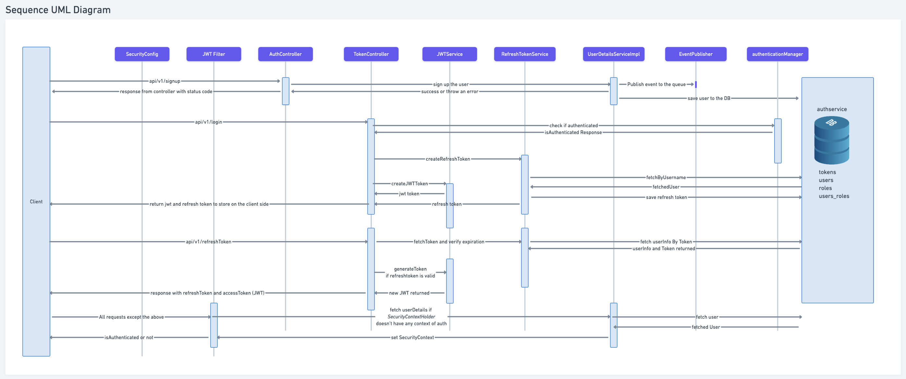
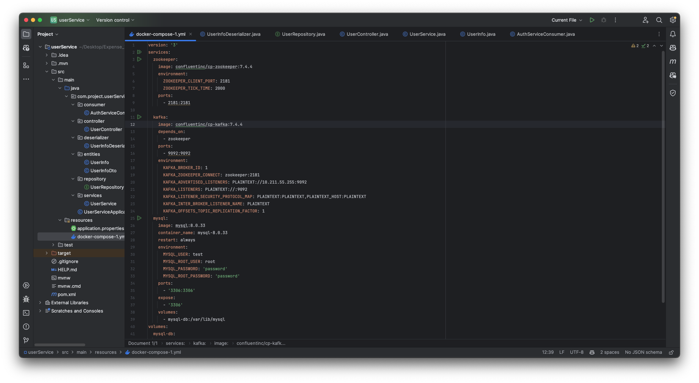
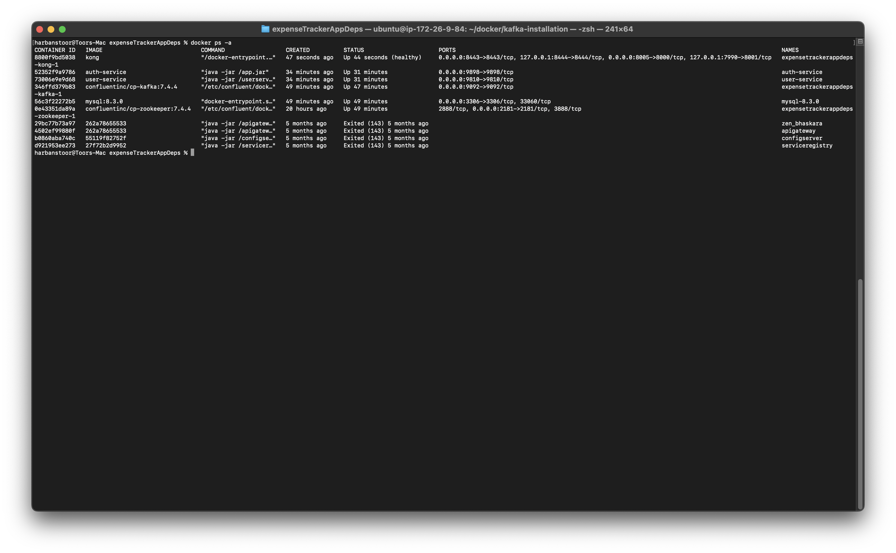

# Expense Tracker

## Overview
Expense Tracker is a comprehensive application designed to manage and track user expenses. It utilizes a microservices architecture with multiple components including authentication, user management, Kafka for event streaming, and a frontend built with React Native. 

## Low Level Design



## Auth Service
The Auth Service handles user authentication and authorization.

### Features:
1. **Entities:**
   - `RefreshToken`: Manages refresh tokens.
   - `UserInfo`: Stores user information.
   - `UserRole`: Manages user roles.

2. **Repositories:**
   - `RefreshTokenRepository`: Handles operations related to refresh tokens.
   - `UserRepository`: Handles operations related to users.

3. **Services:**
   - `JwtService`: Manages JWT tokens (creation, validation, extracting claims, checking expiry).
   - `UserService`: Manages user-related operations.
   - `RefreshTokenService`: Manages refresh tokens.

4. **Database:**
   - Uses MySQL to store user information and tokens.

5. **Security:**
   - Implements `SecurityFilterChain` to secure incoming requests.

6. **Controller:**
   - `AuthController`: Manages signup and other authentication-related endpoints.

## Kafka Integration
Kafka is used to handle asynchronous communication between services.

### Auth Service:
1. **Producer:**
   - Implemented a Kafka producer with a Kafka template.
   - Custom serializer to send custom objects.

### User Service:
1. **Consumer:**
   - Implemented a deserializer to read serialized byte data.
   - Exposes APIs for creating and reading user info.
   - Creates repositories for user data management.

### Event Flow:
- The Auth Service sends data (publishes events) to Kafka after user signup.
- The User Service consumes these events to process user data.


## Docker
- Docker is used to containerize and initialize Kafka, MySQL, and Zookeeper.
- Ensure IP addresses of the containers match the localhost for proper connectivity.




## API Gateway
- Uses Kong as an API gateway to redirect API requests efficiently.

## Python, Langchain, and OpenAI Integration
- Utilizes Python, Langchain, and OpenAI API to extract expenses from SMS.
- Langchain structures the data for LLM.
- Python is chosen due to its ease of use for tasks where low latency is not critical.

### Setup:
- Install all Python dependencies in a virtual environment to avoid global installations.

### Data Flow:
- `DsService` sends data to Kafka, which is then consumed by `ExpenseService`.

## Frontend
- The frontend is built using React Native for a seamless user experience on mobile devices.

## Setup Instructions:
1. **Clone the repository:**
   ```bash
   git clone https://github.com/harbanssinghtoor/expense_tracker.git

2. **Navigate to project directory:**
   cd expense_tracker

3. **Setup Docker:**
   docker-compose up --build

4. **Install python dependencies:**
   cd python_service
   python -m venv venv
   source venv/bin/activate
   pip install -r requirements.txt

5. **Start the services:**
   Auth Service, User Service, and other microservices as per their respective instructions.

6. **Run the frontend:**
   cd frontend
   npm install
   npm start

### License:
This project is licensed under the MIT License.


   

