# Expense Tracker Application

This Expense Tracker application is built using Java, Spring Boot, Docker, Kafka, and Linux. It consists of two main services: AuthService and UserService.

## Technologies Used
- [Java](https://dev.java/learn/)
- [Spring Boot](https://spring.io/projects/spring-boot)
- [Docker](https://docs.docker.com/)
- [Postman](https://www.postman.com/downloads/)
- [Kafka](https://kafka.apache.org/)
- [Linux](https://www.linux.org/)

## AuthService
The AuthService handles the creation and validation of RefreshTokens and JWT tokens, while also utilizing repositories to store tokens and user data in a MySQL database. Additionally, it acts as a Kafka producer by pushing serialized user data.

### Implementation Details:
1. **Virtual Private Server Setup**: Created a virtual private server by installing Ubuntu Server on a virtual machine.
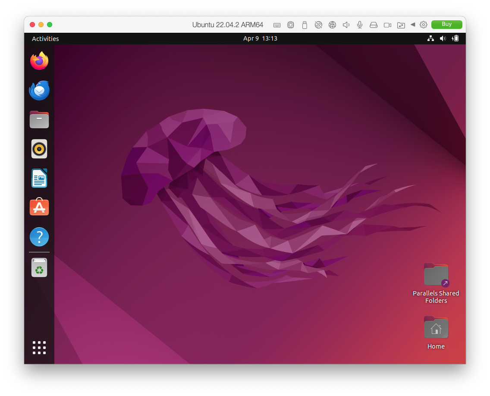
2. **Entity Creation**: Developed entities for RefreshToken, UserInfo, and UserRole.
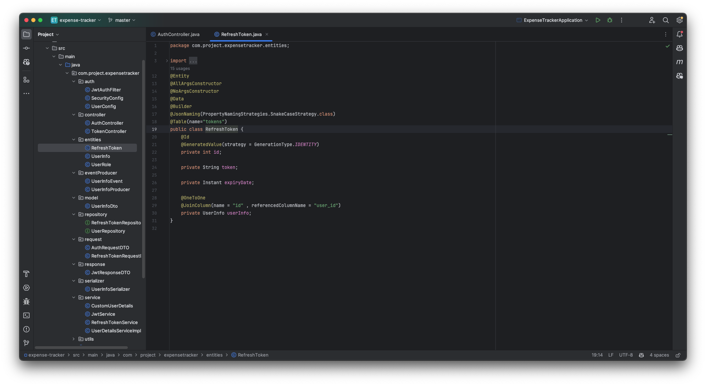
3. **Repository Setup**: Established repositories for RefreshToken and User.
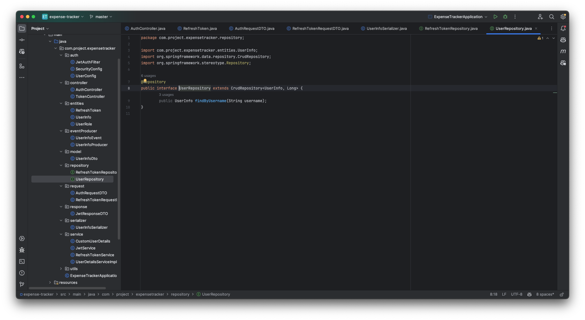
4. **Service Implementation**: Implemented services for Jwt, User, and RefreshToken to handle token extraction, creation, validation, and expiry checks.
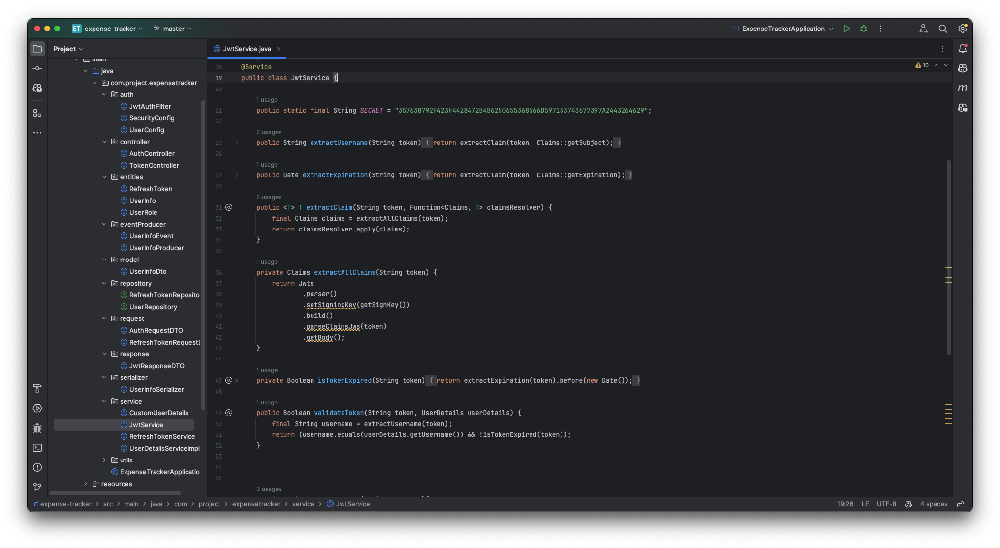
5. **Database Integration**: Utilized MySQL to store all user information, including tokens.
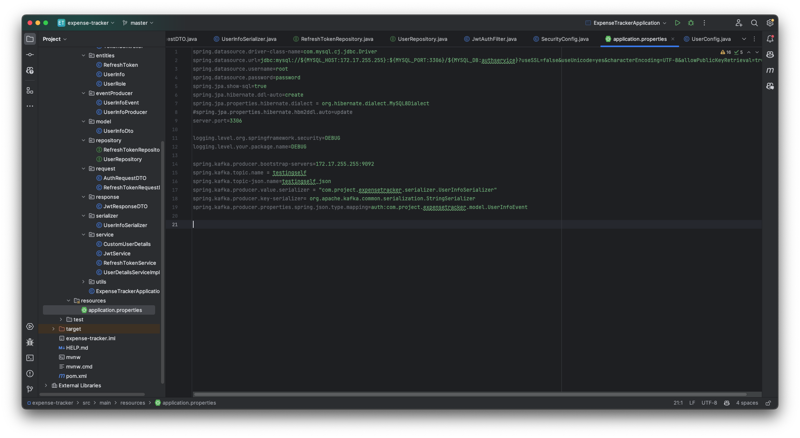
6. **Security Implementation**: Implemented securityFilterChain to manage incoming requests.
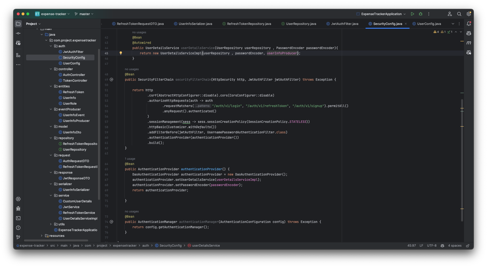
7. **Controller Development**: Created AuthController for user signup functionality.
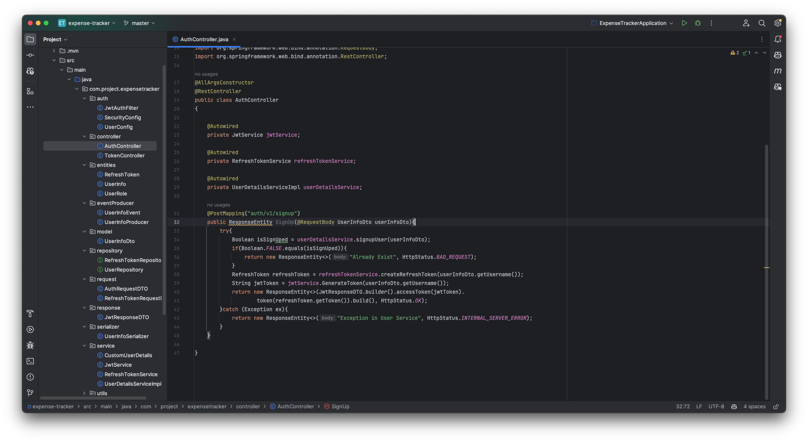
8. **MySQL Installation**: Installed MySQL on the virtual machine and established a connection with the local machine.

  
## UserService

1. **Deserializer Implementation**: Implemented a deserializer to read serialized byte data in UserService.
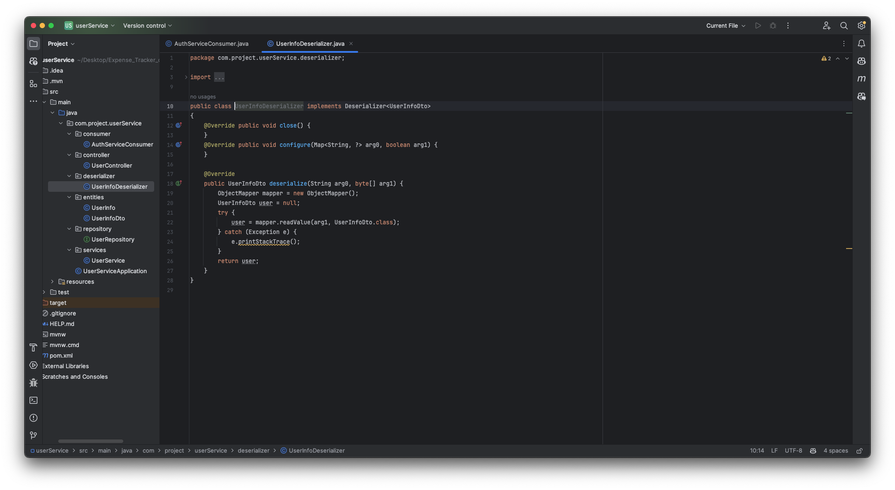
2. **API Exposition**: Exposes APIs for creating and reading user information.
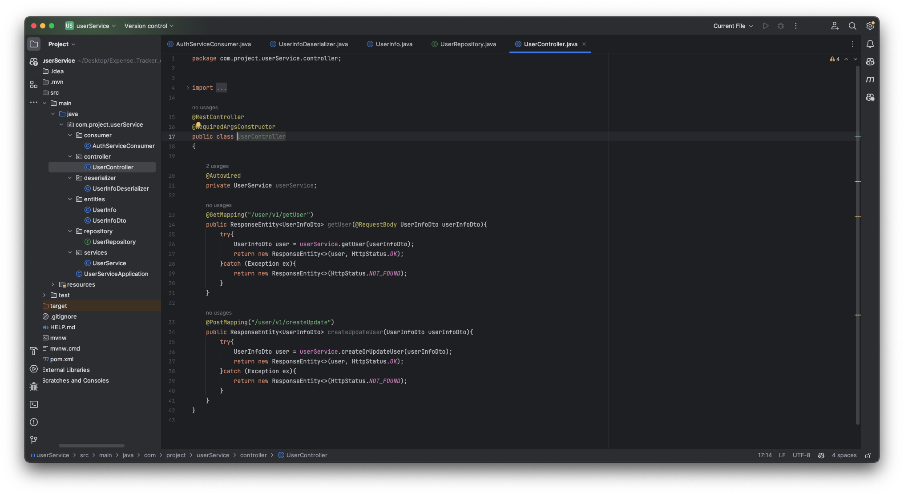
3. **Entity Creation**: Creates entities for user information storage.
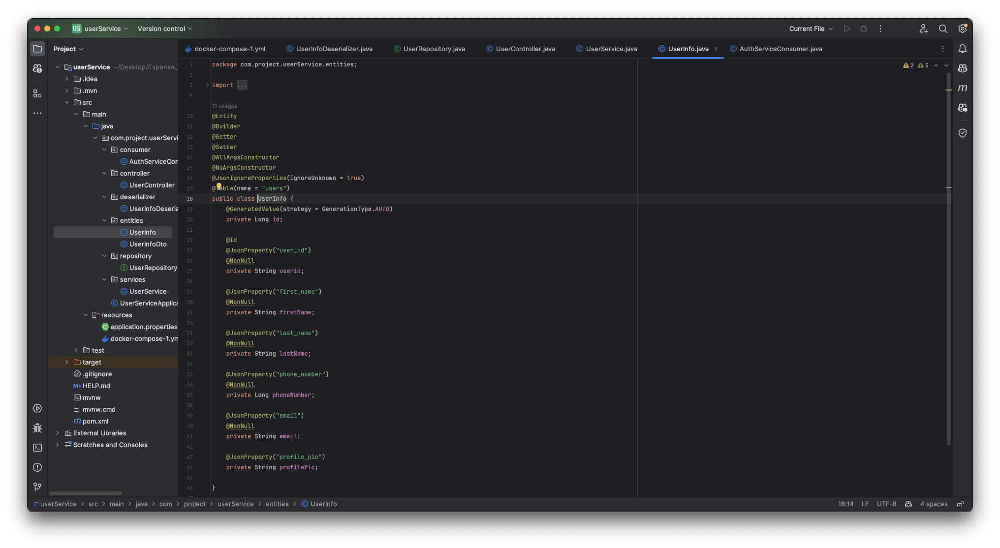

## Setup Instructions
1. Clone the repository.
2. If using Mac, install Parallels Desktop and set up a virtual machine with Ubuntu installed on it.
3. Install Docker on the virtual machine created using Parallels.
4. Build the Docker images for Kafka, MySQL, AuthService, and UserService.
5. Define the properties of the containers using Docker File.
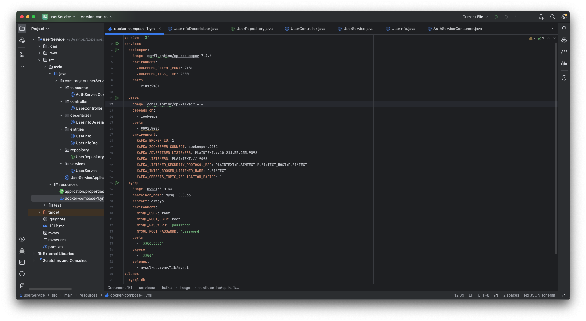

6. Run the Spring Boot applications for AuthService and UserService.
7. Send user data through Postman by hitting the APIs.
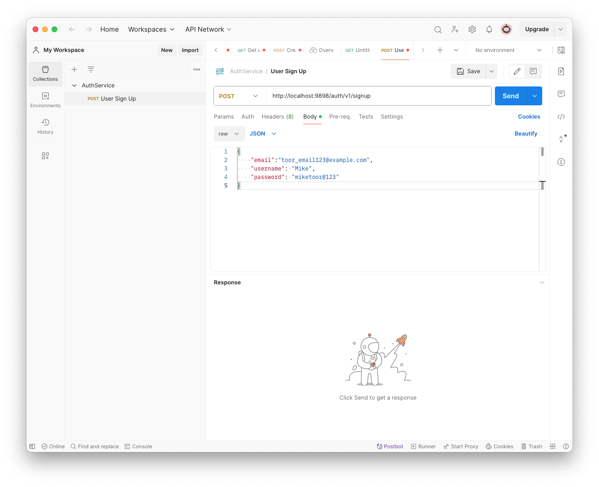

## Contributing
Contributions are welcome. Please feel free to submit pull requests or open issues if you encounter any problems.

## License
This project is licensed under the [MIT License](LICENSE).